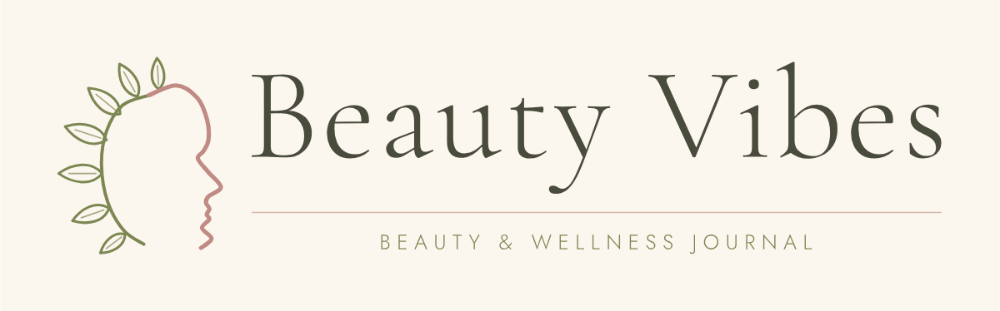

# Beauty Vibes — brand assets

A logo for the Beauty Vibes beauty and wellness blog: an elegant serif wordmark
paired with a minimal line-art mark — a feminine profile whose crown is drawn as a
growing botanical branch. Muted olive green, dusty rose, warm ivory ground. Flat
vector line art only: no shadows, no gradients, no 3D, no photography.



## Files

| File | Use |
| --- | --- |
| `beauty-vibes-logo-horizontal.svg` | Primary lockup — website header, ivory ground |
| `beauty-vibes-logo-horizontal-transparent.svg` | Same lockup over your own background |
| `beauty-vibes-logo-horizontal-olive.svg` | One-colour deep olive, for stamps, watermarks and single-ink printing |
| `beauty-vibes-logo-compact.svg` | Mark + wordmark, no tagline — for headers under ~70 px tall |
| `beauty-vibes-logo-stacked.svg` | Centred lockup for square spaces, covers, print |
| `beauty-vibes-mark.svg` | The symbol alone |
| `beauty-vibes-badge.svg` | Symbol inside a hairline ring — social avatars |
| `beauty-vibes-favicon.svg` | Simplified mark, heavier strokes, holds down to 16 px |

`-transparent` variants of the horizontal, compact and stacked lockups are included.
PNGs are exported alongside (`@2x` where it is worth having).

Every SVG is self-contained: the type is converted to outlines, so nothing depends on
a font being installed and the files render identically everywhere.

## Palette

| Colour | Hex | Role |
| --- | --- | --- |
| Warm ivory | `#FBF6EE` | Background |
| Muted olive green | `#7C8752` | Branch, leaves, tagline |
| Deep olive | `#5E6740` | One-colour logo, headings |
| Dusty rose | `#C08B84` | Face line, hairline rule, accents |
| Deep olive-grey ink | `#494B3C` | Wordmark, body copy |

The ink on ivory pairing (`#494B3C` on `#FBF6EE`) passes WCAG AA and AAA for body text.
Olive on ivory passes AA for large text; keep it for taglines and headings, not
paragraphs.

## Typography

- Wordmark — Cormorant Garamond Light, tracked +2.8%, cap height 96 units.
- Tagline — Jost Light, all caps, tracked +30%, cap height 17 units.

Both are SIL Open Font License 1.1. They are used here only to draw the outlines that
are baked into the finished artwork, so the assets carry no font dependency. Use the
same two faces for headings and UI if you want the site to match.

## Using it

- **Clear space** — keep at least the height of the wordmark's "B" clear on every side.
  The padding built into each file already provides this.
- **Minimum size** — the full lockup down to 180 px wide; below that switch to
  `-compact` (no tagline), and below ~64 px use the mark or favicon alone.
- **Backgrounds** — ivory first. On another colour, use a transparent variant over a
  light, low-chroma ground, or the one-colour olive version. Avoid busy photographs
  behind the line art.
- **Don't** re-colour the mark outside this palette, stretch it, add effects or
  shadows, rebuild the wordmark in another typeface, or separate the face from its
  branch — the two are one drawing.

## Regenerating

```sh
cd src
python3 -m pip install fonttools uharfbuzz
python3 generate.py ../assets      # fetches the two OFL fonts on first run
node export-png.js ../assets       # needs playwright
```

`symbol.py` holds the drawing: the profile and branch are landmark points run through
a Catmull-Rom spline, and the leaves are generated from position, angle and length, so
the mark can be tuned without redrawing bezier handles by hand. `generate.py` composes
the lockups from measured ink bounds, which is what keeps the mark, wordmark, rule and
tagline optically aligned in every variant.
